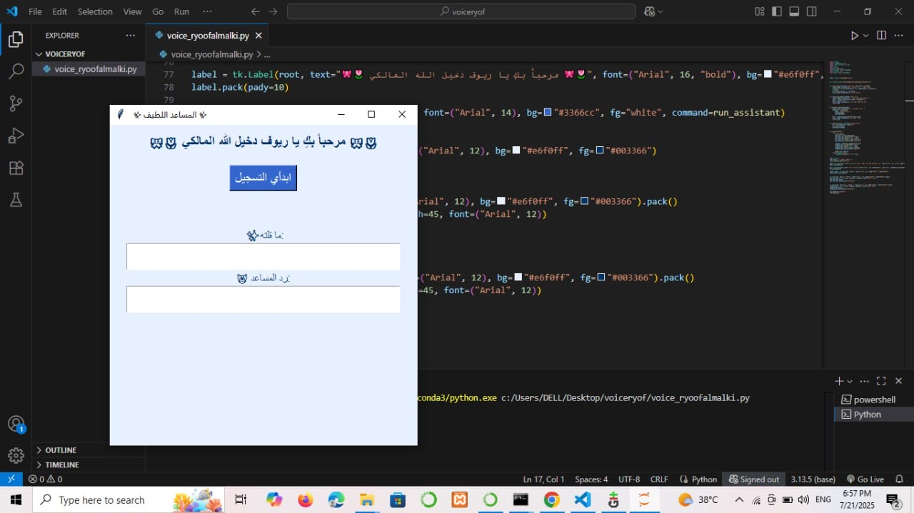
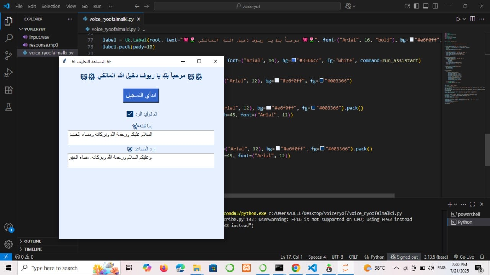

# 🗣️  Task 3 -  Friendly Voice Assistant (Arabic)

This repository contains the source code and assets for a fully functional Arabic voice assistant.  
It allows the user to speak, transcribes their voice using Whisper, generates a smart response using Cohere LLM, then speaks the reply back using gTTS —Everything is integrated into a clean and interactive Tkinter GUI.

---

## 🌷 Features

1. 🎙️ Convert voice input to text (ASR) using OpenAI’s Whisper
2. 💬 Generate intelligent responses via Cohere language model
3. 🔊 Convert text responses to speech using gTTS (Google Text-to-Speech)
4. 🖥️ Display results and interaction in a smooth GUI using Tkinter


---

## 🧠 Tech Stack

- whisper – for automatic speech recognition (ASR)
- cohere – for language model-based response generation
- gTTS – for converting text to speech
- playsound – for playing audio output
- tkinter – for graphical user interface (GUI)

---

## 🎬 Demo Video

📂 [Click here to open the Google Drive folder with the demo video](https://drive.google.com/drive/folders/1_z42bq2Z3i1yBS9npYA5ZF2OYOfqtJnI)

---

## 🖼️ Screenshots

### 🔹 Application Interface During Use  


### 🔹 After Generating the Response  


---

## 🔊 Project Files

- input.wav – Raw user input audio
- response.mp3 – The generated spoken reply
- voice_ryoofalmalki.py – Main application code

---

## 🧾 Code Snippet

```python
 import whisper
import sounddevice as sd
import scipy.io.wavfile as wav
import os
import cohere
from gtts import gTTS
from playsound import playsound
import tkinter as tk
from tkinter import messagebox


model = whisper.load_model("base")


co = cohere.Client("your_api_key_here_ryoooooof") 


def record_audio(filename="input.wav", duration=5, fs=44100):
    status_label.config(text="🎙 التسجيل جاري... تكلمي الآن")
    recording = sd.rec(int(duration * fs), samplerate=fs, channels=1)
    sd.wait()
    wav.write(filename, fs, recording)
    status_label.config(text="✅ تم حفظ الصوت")


def transcribe_audio(filename="input.wav"):
    status_label.config(text="🔍 جارٍ تحويل الصوت إلى نص...")
    result = model.transcribe(filename, language="ar")
    text = result["text"]
    status_label.config(text="✅ تم تحويل الصوت إلى نص")
    return text


def generate_response(prompt):
    status_label.config(text="🤖 جارٍ توليد الرد...")
    response = co.generate(
        model="command-r-plus",
        prompt=prompt,
        max_tokens=100
    )
    text = response.generations[0].text.strip()
    status_label.config(text="✅ تم توليد الرد")
    return text


def speak_text(text, filename="response.mp3"):
    tts = gTTS(text=text, lang="ar")
    tts.save(filename)
    playsound(filename)


def run_assistant():
    try:
        record_audio()
        user_text = transcribe_audio()
        user_text_box.config(state="normal")
        user_text_box.delete("1.0", tk.END)
        user_text_box.insert(tk.END, user_text)
        user_text_box.config(state="disabled")

        response = generate_response(user_text)
        response_box.config(state="normal")
        response_box.delete("1.0", tk.END)
        response_box.insert(tk.END, response)
        response_box.config(state="disabled")

        speak_text(response)
    except Exception as e:
        messagebox.showerror("خطأ", str(e))


root = tk.Tk()
root.title("  ✨ المساعد اللطيف ✨")
root.configure(bg="#e6f0ff")

label = tk.Label(root, text="🎀🌷 مرحباً بكِ يا ريوف دخيل الله المالكي 🎀🌷", font=("Arial", 16, "bold"), bg="#e6f0ff", fg="#003366")
label.pack(pady=10)

btn = tk.Button(root, text="ابدأي التسجيل", font=("Arial", 14), bg="#3366cc", fg="white", command=run_assistant)
btn.pack(pady=10)

status_label = tk.Label(root, text="", font=("Arial", 12), bg="#e6f0ff", fg="#003366")
status_label.pack(pady=10)


tk.Label(root, text=" ✨ما قلته:", font=("Arial", 12), bg="#e6f0ff", fg="#003366").pack()
user_text_box = tk.Text(root, height=2, width=45, font=("Arial", 12))
user_text_box.pack()
user_text_box.config(state="disabled")


tk.Label(root, text="🤖 رد المساعد:", font=("Arial", 12), bg="#e6f0ff", fg="#003366").pack()
response_box = tk.Text(root, height=2, width=45, font=("Arial", 12))
response_box.pack()
response_box.config(state="disabled")

root.geometry("460x480")
root.mainloop()

```


---


## 🎀🌷 Created by 🎀🌷

🎀 Ryoof Dkheel Allah Al-Malki 🎀


---

